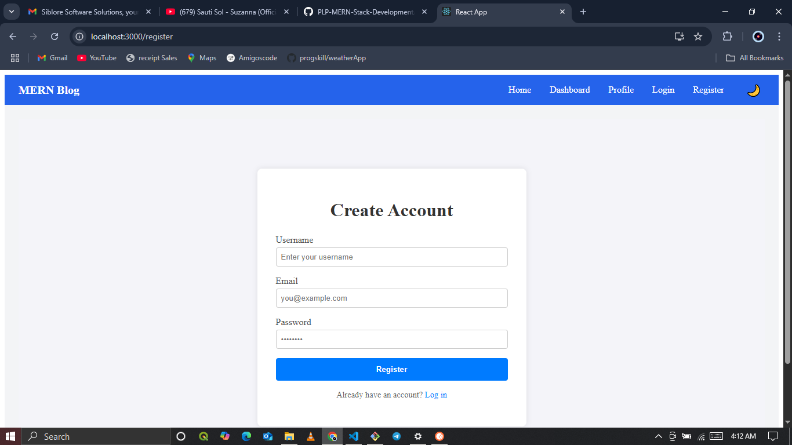

MERN Blog Application
A full-stack MERN Blog Application with:

MongoDB, Express.js, Node.js backend

React.js + TailwindCSS frontend

Full CRUD for blog posts

User authentication & authorization

Comments, categories, tags, featured image upload

Dark mode toggle

Loading spinners & toast notifications

Protected routes

Forgot password & profile pages

🚀 Features
✅ User registration & login
✅ JWT authentication & session storage
✅ Protected dashboard
✅ Create, Read, Update, Delete blog posts
✅ Featured image upload with preview
✅ Categories & tags per post
✅ Comments on posts
✅ Post view count
✅ Dark/light theme toggle
✅ Loading indicators & notifications
✅ Responsive TailwindCSS design
✅ Forgot password flow
✅ Profile page with user info & logout

🗂️ Project Structure
bash
Copy
Edit
mern-blog/
├── client/                # React frontend
│   ├── public/
│   ├── src/
│   │   ├── components/    # Navbar, PostForm, Spinner, PostCard, etc.
│   │   ├── context/       # ThemeContext
│   │   ├── hooks/         # useAuth.js
│   │   ├── pages/         # Home, Dashboard, Login, Register, Profile, etc.
│   │   ├── services/      # postService.js, categoryService.js
│   │   ├── App.jsx
│   │   └── main.jsx
│   ├── .env
│   ├── tailwind.config.js
│   └── package.json
├── server/                # Node.js backend
│   ├── config/            # DB connection, JWT secret
│   ├── controllers/       # authController.js, postController.js, etc.
│   ├── middleware/        # authMiddleware.js, errorHandler.js
│   ├── models/            # User.js, Post.js, Category.js
│   ├── routes/            # authRoutes.js, postRoutes.js, categoryRoutes.js
│   ├── uploads/           # uploaded images
│   ├── .env
│   └── package.json
└── README.md
⚙️ Installation
🖥 Backend
bash
Copy
Edit
cd server
npm install
Create .env in /server:

ini
Copy
Edit
PORT=5000
MONGODB_URI=mongodb://localhost:27017/mern-blog
JWT_SECRET=your_jwt_secret
Start backend:

bash
Copy
Edit
npm run dev
🌐 Frontend
bash
Copy
Edit
cd client
npm install
Create .env in /client:

bash
Copy
Edit
REACT_APP_API_URL=http://localhost:5000/api
Start frontend:

bash
Copy
Edit
npm start
Frontend runs at http://localhost:3000

📝 Available Pages
✅ / — Home page: latest posts
✅ /dashboard — Dashboard (protected)
✅ /create-post — Create new post
✅ /edit-post/:slug — Edit existing post
✅ /posts/:slug — Post detail page
✅ /login — Login page
✅ /register — Register page
✅ /forgot-password — Forgot password page
✅ /profile — Profile page (protected)

🎨 Tech Stack
Frontend

React.js

TailwindCSS

React Router

Axios

react-hot-toast

Backend

Node.js

Express.js

MongoDB + Mongoose

Multer (file uploads)

JWT (authentication)

Authentication
Register a new account or login

JWT token saved in localStorage

Protected routes only accessible when logged in

Logout clears session

Dark Mode
Toggle between light & dark theme via button in Navbar.
Preference is persisted in localStorage.

Image Upload
Post creation & edit allows uploading a featured image.
Images are saved to /server/uploads.

Forgot Password
Forgot password page sends an email (backend must implement /auth/forgot-password route).

Profile Page
Shows logged-in user info & logout button.

